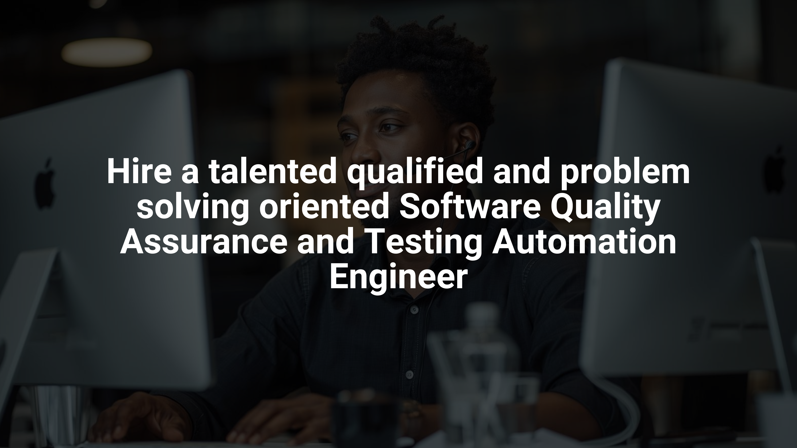

<!-- Banner / Cover Image -->

  

<h1 align="center">Hello and welcome to my GitHub page! I am Roland.</h1>

  <strong>I am enthousiastic about and professionally committed to Software Quality Assurance and Testing Automation Engineering, Tech entrepreneurship & Vocational education.  
  <em>Education mantra: Parce que vous en êtes capable.</em>
  </strong>

## 🧠 What am'I good at?

I am a software quality assurance specialist and a software engineer, with a relentless drive to business impact through testing automation, DevOps, and an entrepreneurial mindset, espacially in the vocational training sphere. 

With experience leading cross-functional QA initiatives across corporate and communities ecosystems, I bridge the gap between software quality, upskilling and reskilling people trough my QA, Programming, and Automation Engineering expertise. What your company and I are able to work on during the next months or years?

- **Architect and develop scalable test automation frameworks** using Java, Selenium, Appium, TestNG, and CI/CD pipelines (GitHub Actions, GitLab CI, Jenkins).

- **Build and invest on vocational training inside [la Fédération pour l'Entrepreneuriat Durable](https://www.la-fed.org/)** - a social organization on which I am managing foundational actions, empowering workers with tailored and high level programing skills onto and for SQA, specifically.

## 🛠 Here come my skills and technical stack

- **Languages & Frameworks:** `Java` • `Spring` • `Selenium` • `Appium` • `TestNG` • `Groovy` • `Python`

- **Automation & DevOps:** `Maven` •`CI/CD` • `Jenkins` • `GitHub Actions` • `GitLab CI` • `Docker` • `Linux`

- **Tools & Collaboration:** `Jira` • `Xray` • `Confluence` • `Bitbucket` • `GitHub` •`Git`

- **Database & Cloud:** `MySQL` • `MariaDB` • `SQL` • `Docker`

- **Methodologies & Processes:** `Agile@Scale` • `Spotify Model` • `QA Strategy` • `BDD` •`TDD` • `Scrum`

## 📚 My current education and engineering focus areas

1.  Building a universal QA Automation Framework to support competencies development and and Quality Assurance as a standalone professional industry.

2. Coaching QA Engineers & "developer teams" on **best practices in testing** and **how to align so they become professionally able to join the "test tribe"**.

3. **Designing micro-learning contents for upskilling and reskilling pursposes.**

## 📜 Here are some of my certifications

Here are some of (not all, and not the best ones, of course...) my official certifications in the fields of Software Quality Assurance, Automation, Cloud, and Project Management:

### 🎓 On Software Quality Assurance & Testing Automation Engineering.

  
  
  

### ☁ On Xray tooling, Cloud and Collaboration

  
  
  
  
  

### 📈 On Business, Entrepreneurship & Project Foundations

  

  
  
    
    

## 🤝 Do you want us to work together?

**I'm open to:** 

- `Strategics on software testing and vocational training consulting`

- `QA Consulting and Engineering Positions`

- `Test Automation Engineering missions ` 

- `Digital and or on-site training projects` 

- `Local collaboration (Remote and/or On-site missions)`

Let's connect, please feel free to email me at: [roland@la-fed.org](mailto:roland@la-fed.org). You can also WhatsApp me [here](https://wa.me/message/JEBVD3SN7G32O1).

## In other hand, you can as well support my opensource and free work on automated testing [here](https://github.com/sponsors/iamrdb2f).
