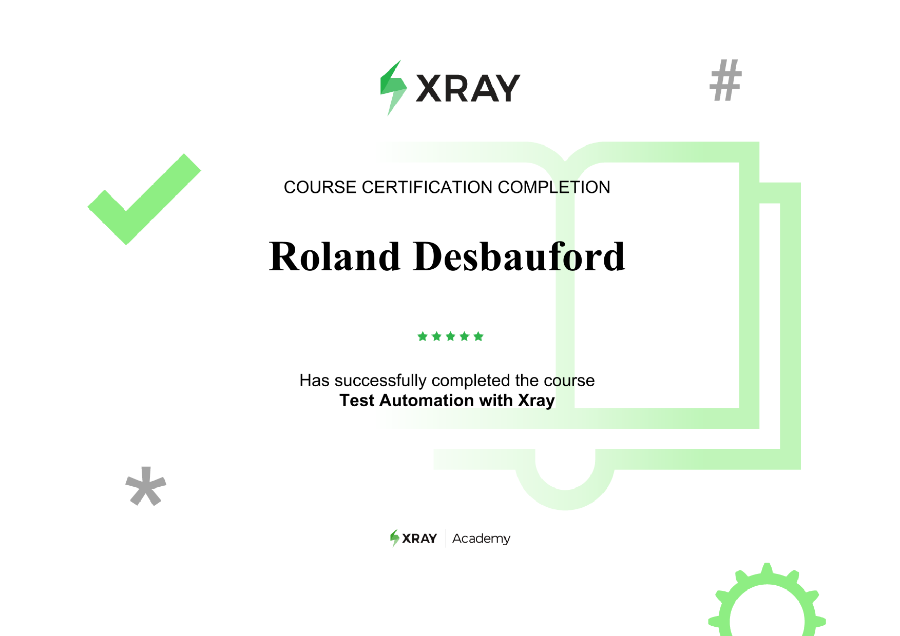
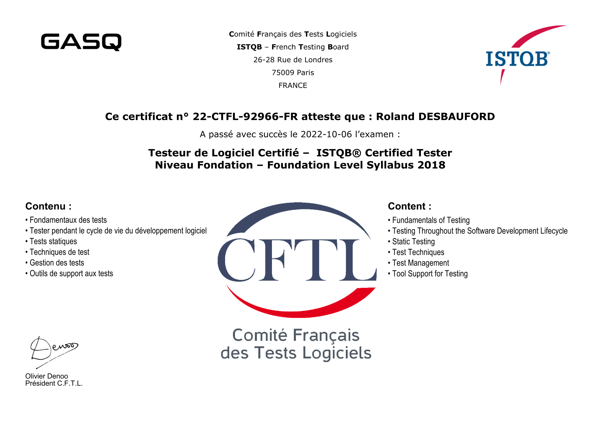
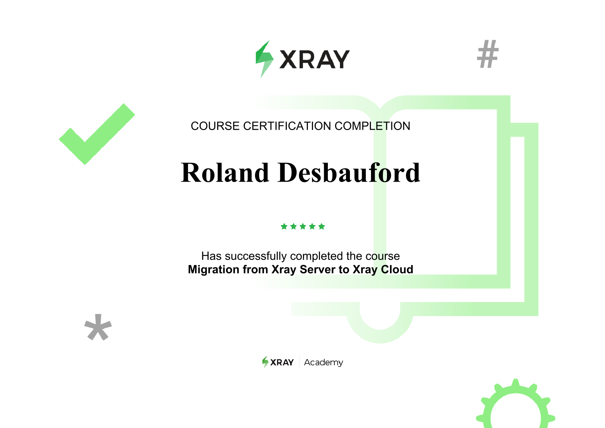
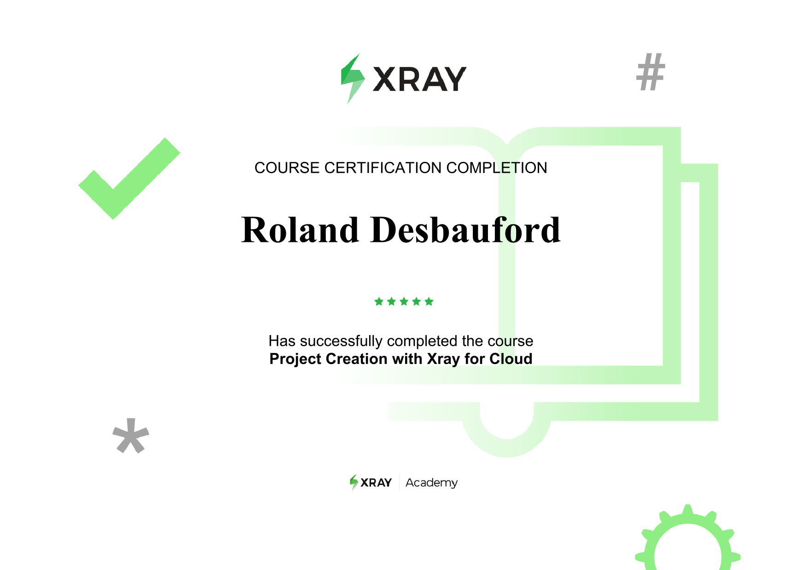
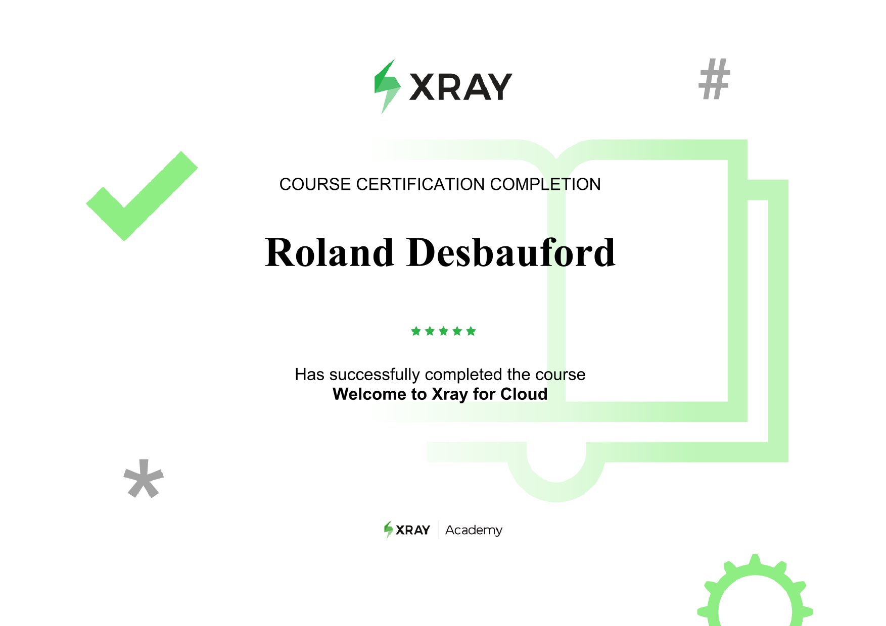
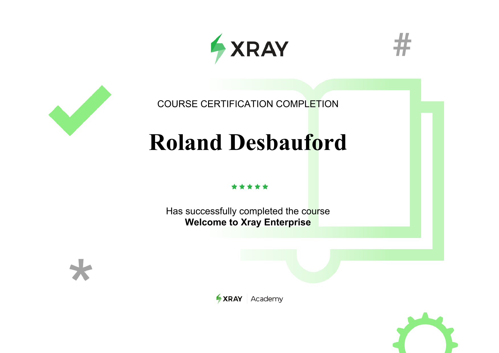

<!-- Banner / Cover Image -->

  

<h1 align="center">Hello, My name is Roland</h1>

  <strong>I am enthousiastic about QA Automation Automation, Tech Entrepreneurship & Vocational Education. 
  <em>Parce que vous en êtes capable !</em>

## 👋🏾 Who am'I?

> I’m a software quality specialist with a relentless drive to scale impact through test automation, DevOps engineering, and tech-driven entrepreneurship, espacially in the vocational training sector.
> With experience leading cross-functional QA initiatives across corporate and communities ecosystems, I bridge the gap between software delivery and quality excellence.
> Let's automate it, integrate, deploy and deliver faster!

---

🧠 **Architect of scalable test automation frameworks** using Java, Selenium, TestNG, and CI/CD pipelines (GitHub Actions, GitLab CI, Jenkins).

🚀 **Founder & CEO of [La FED](https://www.la-fed.org/)** — a social organization empowering workers with tailored and high level skills in QA and in the sphere of digital, in general.

---

## 🛠 Tech stack

**Languages & Frameworks:** `Java` • `SpringBoot` • `Selenium` • `TestNG` • `Groovy` • `Python`

**Automation & DevOps:** `CI/CD` • `Jenkins` • `GitHub Actions` • `GitLab CI` • `Docker` • `Linux`

**Tools & Collaboration:** `Jira` • `Xray` • `Confluence` • `Bitbucket` • `Git`

**Database & Cloud:** `MySQL` • `MariaDB` • `SQL` • `Docker Hub`

**Methodologies:** `Agile @Scale` • `Spotify Model` • `QA Strategy` • `TDD` • `Scrum`

---

## 📚 Current focus areas

> Building a universal QA Automation Framework to support competencies development and industrials.
> Coaching QA Engineers & dev teams on **best testing practices** and **How to align so they become able join the "Test tribe"**.
> Designing micro-learning content for digital upskilling and/or reskilling.

---

## 📜 My certifications

Here are some of (not all, of course...) my official certifications in the fields of QA, automation, cloud, and business project management:

### 🎓 Quality Assurance & Testing

  
  
  

---

### ☁ Xray & Cloud

  
  
  
  
  

---

### 📈 Business & Project Foundations

  
  

---

## 🤝 Work with me

**I'm open to:** `Strategic` • `QA consulting` • `Test Automation Engineering` • `Digital training projects` • `International collaboration (Remote/In site)` • `Let's connect:` [roland@la-fed.org](mailto:roland@la-fed.org)

---
