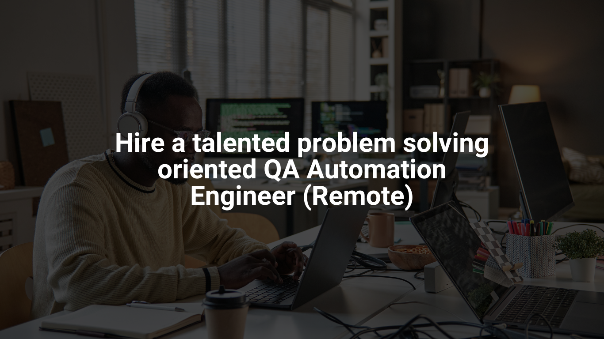

<!-- Header Section -->

    

<h1 align="center">✋🏾 Hi, I'm Roland!</h1>

    

---

## 🚀 About Me

👨‍💻 **QA Automation Engineer | Software Engineer | Entrepreneur**  
🔹 Passionate about **Software Quality Assurance**, I have **5+ years of experience** in test automation, training, and consulting.  
🔹 Skilled in **developing robust test automation frameworks** and **optimizing CI/CD pipelines** to enhance software quality.  
🔹 Entrepreneur and mentor, helping businesses and professionals **improve digital transformation and software reliability**.  

---

## 🔥 Key Skills

💻 **Test Automation:** Java, Selenium, Jenkins, CI/CD, TestNG  
🛠 **Backend Development:** Java (SpringBoot), API Testing, MySQL, REST APIs  
🔍 **Agile & DevOps:** Agile (Scrum), Spotify@Scale, Test Strategy, Cloud Deployments  
🌍 **Languages:** French (Native), English (Professional)  

---

## 🏆 Featured Projects

🔹 [**Test Automation Exercise**](https://github.com/iamrdb2f/TestAutomationExercise)  
_A robust Selenium-Java automation framework for testing Automation Exercise._  

🔹 [**Federation for Sustainable Entrepreneurship**](https://www.la-fed.org/)  
_A digital learning platform empowering professionals in QA and sustainable entrepreneurship._  

---

## 📢 Looking for Collaboration?  

I’m open to **freelance, consulting, and full-time opportunities** in:  
✅ **Test Automation** | ✅ **QA Strategy & Consulting** | ✅ **Software Engineering & Training**  

📫 **Contact me:**  
📧 **Email:** [📩 roland@la-fed.org](mailto:roland@la-fed.org)  

🌍 **Freelance Profiles:**  
- 🟢 [**Upwork**](https://www.upwork.com/freelancers/~017651e3fba024b670?mp_source=share)  
- 🔵 [**Malt**](https://www.malt.fr/profile/rolandguissony1)  
- 🟠 [**PeoplePerHour**](https://www.peopleperhour.com/freelancer/roland-guissony-qa-automation-engineer-java-zyzwnamn)  
- 🟩 [**HackerRank**](https://www.hackerrank.com/profile/rdb2f)  

---

## 🌎 Connect with Me

📡 **Follow me on social media:**  
<a href="https://linkedin.com/in/rdb2f/" target="blank"> 🔹 **LinkedIn** </a>  
<a href="https://www.facebook.com/lafed.org" target="blank"> 🔹 **Facebook** </a>  

---

## 🛠 Technologies & Tools

🚀 **Development & Automation**  
☕ **Java**  
✅ **Selenium**  
🏗 **Jenkins**  
🖥 **Git, Gitlab, Bitbucket & GitHub**  
🐍 **Python**  

📦 **Databases & Cloud**  
- 🗄 **MySQL, MariaDB & NoSQL**  
- 🛠 **Docker**  

📌 **Testing & DevOps**  
- 🔍 **Jira & Xray**  
- ⚙ **CI/CD Pipelines**  
- 🍃 **Spring Boot**  
- 🖥 **Linux (Ubuntu, Debian.)**  

---

## 💡 My philosophy to life

    <em>"Excellence is a process, not an event."</em>

